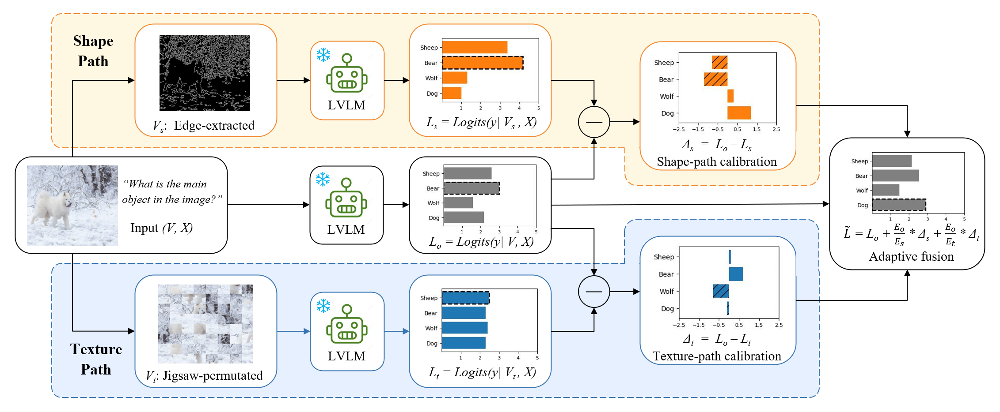

# ST-CD: Revisiting Visual Corruptions in LVLMs via Shape-Texture Dual-Path Contrastive Decoding

Official implementation of **ST-CD**, a training-free inference framework for improving the robustness of large vision-language models (LVLMs) under heterogeneous visual corruptions.

## Overview

Large vision-language models are highly sensitive to corrupted visual inputs such as blur, noise, color shifts, and geometric distortions. In this work, we revisit LVLM robustness from a corruption-centric perspective and show that heterogeneous corruptions can be organized into two complementary perceptual dimensions: **shape-degraded** and **texture-degraded** corruptions.

Based on this observation, we propose **Shape-Texture Dual-Path Contrastive Decoding (ST-CD)**, a training-free framework that constructs:

- a **shape-aware path** via edge extraction,
- a **texture-aware path** via jigsaw permutation,
- and an **adaptive entropy-based fusion** strategy to combine the two correction signals.

ST-CD is plug-and-play, requires no retraining, and consistently improves robustness across multiple LVLMs and benchmarks.

  

## Highlights

- **Corruption-centric analysis** of LVLM robustness through **shape** and **texture** dimensions
- **Dual-path contrastive decoding** with complementary perceptual views
- **Training-free** and **plug-and-play**
- Evaluated on **LLaVA-1.5**, **Qwen-VL**, and **mPLUG-Owl2**
- Robustness validated on **ImageNet10-C**, **MMBench-C**, **POPE-MSCOCO-C**, and **RWIC-VQA**

## TODO

- [ ] Release inference code for ST-CD
- [ ] Release evaluation pipeline for ImageNet10-C
- [ ] Release scripts for MMBench-C / POPE-MSCOCO-C / RWIC-VQA
- [ ] Release reproducibility instructions
- [ ] Release checkpoints / logs / examples

